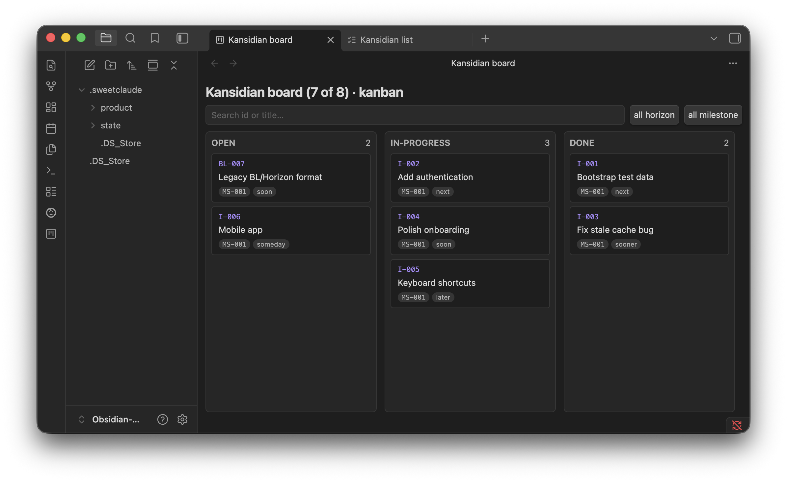
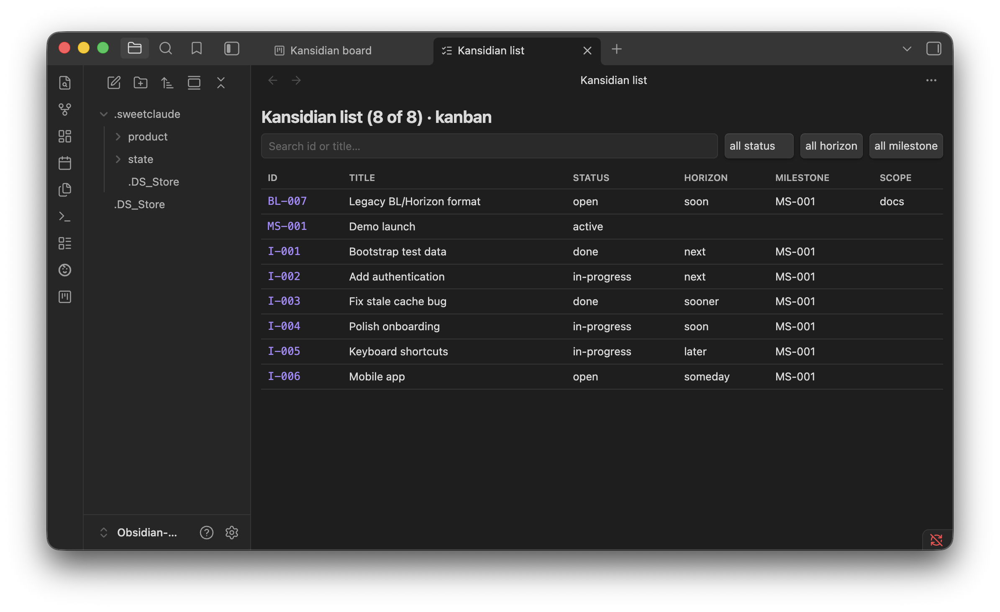
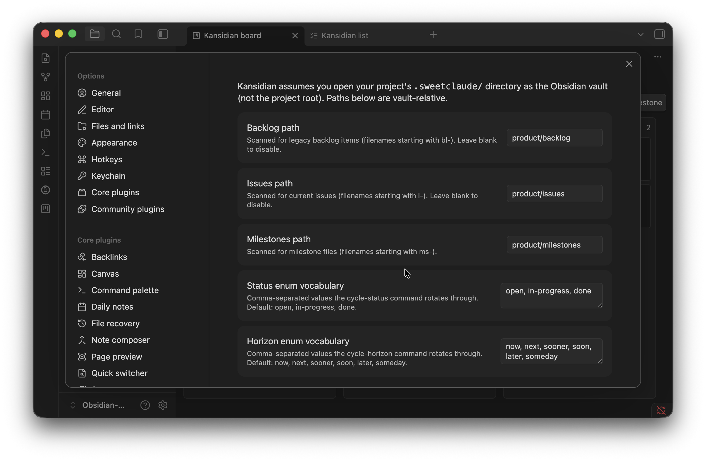

# Kansidian

> A non-destructive Kanban view over [SweetClaude](https://github.com/carson-sweet/sweetclaude) project work, inside [Obsidian](https://obsidian.md).

[](./LICENSE)
[](https://github.com/dseaman/Kansidian/releases)

Kansidian gives SweetClaude users a board and a list view over their project's issues (`I-*`) and milestones (`MS-*`). It reads SweetClaude's native bold-key markdown directly, lets you drag cards between status columns, edit enums inline, search and filter, and writes changes back to the same files with annotations preserved byte-identical.

SweetClaude in Claude Code remains the primary working interface — Kansidian is a visibility and ergonomics layer alongside it.

---

## Screenshots

### Board view



### List view with inline status picker



### Settings



---

## Features

- **Board view (kanban).** Columns by status, cards by work item, native HTML5 drag-and-drop between columns. Cards show ID, title, milestone, and a horizon chip.
- **List view (table).** All items in a sortable-feeling table with ID, title, status, horizon, milestone, and scope columns. Click ID/title to open the file.
- **Inline enum editing.** Click a status or horizon cell in the list view to pop a native Obsidian picker; pick a new value to write it to disk.
- **Non-destructive writes.** Annotations like `done (merged 2026-05-19, PR #29)` or `deferred — blocked on …` are preserved byte-identical when you change the leading enum. The full file content outside the field stays untouched.
- **Search.** Type in the toolbar's search box to filter by ID or title. Focus and cursor position survive re-renders. Clear with the ✕ button or by clearing the field.
- **Filter dropdowns.** Filter by status, horizon, or milestone. Filters are populated from the actual values present in your vault.
- **FLIP animation.** When a card moves between columns, it animates from its old position to the new one with a brief destination flash so you can track what happened.
- **Mode-aware views.** Kansidian reads your project's `mode` field from `state/phase.yaml` and adapts: kanban/agile render normally, flow mode shows a placeholder ("work is inferred"), Shape Up mode explains the kanban doesn't apply, unset mode renders normally (for SweetClaude projects that haven't set a mode field — e.g. older convention).
- **Cycle commands.** `Cycle status forward` and `Cycle horizon forward` rotate through your configured enum vocabularies for the active file — useful with hotkeys.
- **Configurable enum vocabularies.** Status and horizon rotation sets are settings — set your own if your project uses non-default values.
- **Dual convention support.** Reads both the framework-standard `I-*` (current SweetClaude) and the legacy `BL-*` convention some projects use. Recognizes `**Horizon:**` and `**Priority:**` as the same field. Milestone values like `MS-002-browser-extension-mvp` canonicalize to `MS-002`.
- **Ribbon icon.** One-click access to the board from Obsidian's left ribbon.

## Compatibility

- **Obsidian:** 1.5.0 or newer (per `manifest.json`).
- **Platforms:** desktop. `isDesktopOnly: false` is declared, but views are not optimized for narrow screens. Tested on macOS.
- **SweetClaude:** any project with `MS-*` milestone files and either `I-*` or `BL-*` work items. Tested against the framework's 3.68.6 release with a vault containing both conventions.

## Installation

### BRAT (recommended)

1. Install [BRAT](https://github.com/TfTHacker/obsidian42-brat) from Obsidian's Community Plugins.
2. In BRAT settings → **Add Beta Plugin**, paste `https://github.com/dseaman/Kansidian`.
3. Enable **Kansidian (SweetClaude Kanban)** in Community Plugins.

### Manual install

1. Download `main.js`, `manifest.json`, and `styles.css` from the latest [GitHub release](https://github.com/dseaman/Kansidian/releases).
2. Create the plugin folder inside whichever vault you'll use:
   - Option A (project root as vault): `<your-project>/.obsidian/plugins/kansidian/`
   - Option B (`.sweetclaude/` as vault): `<your-project>/.sweetclaude/.obsidian/plugins/kansidian/`
3. Drop the three files into that folder.
4. In Obsidian, enable Kansidian in **Community plugins**.

See [Vault setup](#vault-setup) for the difference between the two layouts.

## Vault setup

Kansidian supports two vault layouts and auto-detects which one you're using. Pick whichever fits your workflow:

### Option A — open your project root as the vault (recommended for multi-project setups)

```text
your-project/                     # ← open THIS as your Obsidian vault
├── src/                          # your code (visible in the file explorer)
├── package.json                  # also visible
└── .sweetclaude/                 # Kansidian finds and reads this via vault.adapter
    ├── product/{backlog,issues,milestones}/
    ├── state/phase.yaml
    └── …
```

Each project gets a distinct vault name (your project's directory name) — solves the "all my vaults show as `sweetclaude`" problem. Trade-off: Obsidian's indexer skips dotdirs, so `.sweetclaude/*` files don't have `TFile` references. Kansidian uses `vault.adapter` (low-level filesystem access) for everything it needs internally, so board / list / drag / edit all work — but **click-to-open** a card falls back to the system handler (your OS default markdown app) instead of opening in an Obsidian editor pane.

To get full Obsidian integration in Option A, install a community plugin that makes the indexer include dotdirs (search community plugins for "Show Hidden Files" or "Show Dotfiles"). With one installed, `.sweetclaude/*` becomes regular indexed files and click-to-open lands in Obsidian. Kansidian detects this at load and adapts.

### Option B — open `.sweetclaude/` itself as the vault (original mode)

```text
your-project/.sweetclaude/        # ← open THIS as your Obsidian vault
├── product/{backlog,issues,milestones}/
├── state/phase.yaml
└── …
```

Click-to-open works natively. Trade-off: every project's vault root is `.sweetclaude/`, so multi-project setups all show the same vault name in Obsidian's switcher. ALSO: don't use Obsidian's "Rename vault" — it moves the directory on disk and breaks SweetClaude's hardcoded paths.

To pick the hidden `.sweetclaude/` folder in the vault picker:

- **macOS:** press `⌘` + `Shift` + `.` (period) inside the file dialog.
- **Windows / Linux:** TBD — verify and PR.
- Or symlink for a friendlier name: `ln -sf .sweetclaude my-project-vault` then pick `my-project-vault`.

### Which layout is Kansidian using right now?

The view headers show your detected layout — e.g. `Kansidian board (134 of 134) · kanban`. Kansidian's `Rescan vault and show cache hint` command also surfaces the current mode in its Notice.

## Quick start

After installing and enabling Kansidian:

1. Click the **kanban-square icon** in Obsidian's left ribbon (or open the command palette with `⌘+P` and search for "Kansidian: Open board").
2. The board renders columns by status (`open`, `in-progress`, `done` by default), with one card per work item.
3. **Drag a card** to a different column to change its status. The underlying `.md` file is updated immediately; annotations are preserved.
4. **Click a card** to open the underlying file in a new pane.
5. Open the list view (command palette → "Kansidian: Open list") for a tabular layout with inline enum editing.

## Usage reference

### Board view

- **Columns:** one per status value in your configured vocabulary (`open` / `in-progress` / `done` by default). Any extra status values present in your data appear as additional columns at the right so nothing is hidden.
- **Cards:** show `id` (monospace), `title`, `milestone` badge (if set), and a `horizon` chip (if set).
- **Drag to move:** native HTML5 drag and drop. Drop targets highlight on hover. After drop, the card animates from old to new position; the destination card flashes the accent color for ~900ms so the eye lands at the change.
- **Click a card** to open the underlying file in a new tab.
- **Scope:** the board surfaces only items with `kind: backlog` (i.e. `I-*` and `BL-*`). Milestone files (`MS-*`) are not rendered as cards — they're link targets.

### List view

- **Columns:** `id`, `title`, `status`, `horizon`, `milestone`, `scope` (read from the bold-key `**Scope:**` field if present).
- **Click `id` or `title`** to open the underlying file in a new tab.
- **Click a `status` or `horizon` cell** to pop an inline picker — choose a new value to write it.
- **Empty states:** if no items are indexed yet, the table explains how to check your settings. If filters exclude everything, you see "no items match the current filters."

### Search and filters

Both views share the same toolbar pattern:

- **Search input:** matches `id` or `title` (case-insensitive substring). Focus and cursor are preserved across re-renders so typing isn't disrupted. The ✕ button clears the search and refocuses the input.
- **Filter dropdowns:** `status` (list view only — board's columns already filter status), `horizon`, `milestone`. Options are populated from the unique values currently present in your vault. Choose `all <field>` to clear that filter.

### Drag and drop

Only available in the board view. The plugin uses a custom MIME type (`application/x-kansidian-file-path`) so the drag payload identifies the exact source file by path — not by item ID. This avoids mis-targeting when a project has duplicate IDs (it happens — Saive has six MS-NNN files where IDs collide).

### Inline enum picker

Available in the list view's `status` and `horizon` cells. Clicking pops an Obsidian `Menu` with all configured enum values; the current value carries a ✓ icon. Picking a new value writes to the file. The picker uses Obsidian's native popup so it integrates with whatever theme you have installed.

The `horizon` cell writes back to whichever field name the file actually uses on disk: `**Horizon:**` (legacy/Saive convention) or `**Priority:**` (current SweetClaude convention). The plugin detects which form is present and updates the matching field.

### Cycle commands

- **`Cycle status forward`** — bind a hotkey to this command. With a SweetClaude `.md` file open in an editor pane, the command writes the next status in your configured rotation. Stops at the end and wraps to the start.
- **`Cycle horizon forward`** — same idea, for the horizon/priority field.

Both commands no-op gracefully if the active file isn't a SweetClaude artifact, has no current status/horizon, or has an empty configured rotation.

### Ribbon icon

A kanban-square icon appears in Obsidian's left ribbon. Click to open the board view. Tooltip: "Kansidian board."

### Rescan command

`Kansidian: Rescan vault and show cache hint` rebuilds Kansidian's in-memory index from disk (useful if you suspect your edits diverged from what the plugin sees) and shows a Notice reminding you how to refresh SweetClaude's own cached `session-status.txt`. See [SweetClaude cache staleness](#sweetclaude-cache-staleness).

## Settings reference

Open **Settings → Community plugins → Kansidian** to configure:

| Setting | Default | Purpose |
| --- | --- | --- |
| Backlog path | `product/backlog` | Vault-relative dir scanned for legacy `BL-*` files. Leave blank to disable. |
| Issues path | `product/issues` | Vault-relative dir scanned for current `I-*` files. Leave blank to disable. |
| Milestones path | `product/milestones` | Vault-relative dir scanned for `MS-*` files. |
| Status enum vocabulary | `open, in-progress, done` | Comma-separated; the `Cycle status forward` command rotates through this list, and the board derives its columns from it. |
| Horizon enum vocabulary | `now, next, sooner, soon, later, someday` | Comma-separated; the `Cycle horizon forward` command rotates through this list. |

All three path fields can be cleared if you don't have that artifact type. Path changes trigger a full re-scan immediately.

## Project mode support

Kansidian reads the `mode` field from your vault's `state/phase.yaml` and adapts:

| Mode | Behavior |
| --- | --- |
| `kanban` | Renders normally (the default fit). |
| `agile` | Renders normally. (Sprint-aware filtering is on the roadmap.) |
| `agile_enterprise` | Renders normally. |
| `unset` (no `mode:` field) | Renders normally — covers older SweetClaude projects and the Saive-style `BL-*` convention. |
| `flow` | Shows a placeholder explaining work is inferred in flow mode and there's nothing to render. |
| `shape_up` | Shows a placeholder explaining Shape Up has no backlog by design; suggests waiting for a pitch-board view. |

The current mode is shown in the view header (e.g. `Kansidian board (134 of 134) · kanban`). Changing the `mode:` line in `phase.yaml` triggers an automatic refresh — no plugin reload needed.

## How it works

### Bold-key contract preservation

SweetClaude artifact files lead with a bold-key metadata block:

```markdown
# I-007: MVP Launch Readiness

**Type:** chore
**Status:** in_progress
**Priority:** next
**Effort:** s
**Milestone:** MS-001
**Depends on:** I-001, I-002
```

When Kansidian writes a change (e.g. cycling status from `in_progress` → `done`), it uses a surgical splice: only the leading enum portion of the targeted `**Field:**` line changes. Everything else — the H1, other bold-key lines, the body, and any annotation after the enum (parentheticals, em-dashes, or `-`  separators) — is preserved byte-identical.

The parser and writer are pure TypeScript modules with no Obsidian dependencies, covered by 33 vitest cases including round-trip byte-identity assertions against fixtures drawn from real corpus variation.

### SweetClaude cache staleness

SweetClaude regenerates a cached `state/session-status.txt` via a Claude Code `PostToolUse` hook that fires after Claude Code's own `Write`/`Edit` tool calls. Obsidian's `vault.modify` writes do not go through Claude Code, so the hook does not fire, and the cache goes stale until something else triggers regeneration.

Practical impact: after using Kansidian to drag cards or cycle enums, your project's cached `session-status.txt` shows pre-edit data. Slash commands that recompute from disk (`/sweetclaude:status`) are unaffected — they show live truth. Slash commands or memory tools that read the cached file will show stale data.

Refresh paths:

- Run `/sweetclaude:status` in Claude Code — recomputes from disk (doesn't write the cache, but you see fresh state).
- Edit any file in the framework's watched set (e.g. add a noop line to `state/checkpoint.md`) — triggers the regenerator.
- Start a new Claude Code session — preflight regenerates.

Kansidian's own in-memory index stays in sync with the vault via Obsidian's file-watcher events. The staleness is exclusive to SweetClaude's framework caches, not Kansidian's.

## Known limitations

- **Native SweetClaude artifact types beyond `I-*` / `BL-*` / `MS-*` are not surfaced.** Epics, themes, sprints, roadmap items, releases, pitches, and cycles are readable in Obsidian's native pane but not rendered in the board or list. Filter chips for epic / theme are a likely post-MVP addition.
- **No item creation from inside Kansidian.** Creating a new `I-*` is the framework's job (`/sweetclaude:project-issues new`). A capture command is on the roadmap but blocked on a compatibility-investigation step.
- **No sprint-aware filtering for agile mode.** Agile-mode projects render the same as kanban-mode projects.
- **No Shape Up pitch view.** Shape Up projects see only a placeholder.
- **Desktop-tested only.** The plugin declares `isDesktopOnly: false`, but mobile layouts are unverified.
- **SweetClaude cache staleness** (see above) — Kansidian can't trigger Claude Code's `PostToolUse` hook from within Obsidian.

## Troubleshooting

**"`.sweetclaude/` doesn't show up in Obsidian's vault picker."** Inside the file dialog, press `⌘+Shift+.` (macOS). On Windows/Linux, see [Picking the hidden folder](#picking-the-hidden-folder).

**"The board is empty even though my vault has items."** Check **Settings → Kansidian → paths**. Are the configured paths (backlog / issues / milestones) correct relative to your vault root? Then run **Kansidian: Rescan vault and show cache hint** to force a re-scan.

**"The board shows a placeholder about flow mode but I have items."** Your `state/phase.yaml` has `mode: flow` set. Either remove the line (Kansidian will render normally) or change the mode to `kanban` / `agile`.

**"My status changes don't appear in `/sweetclaude:status` output."** That's likely the cache staleness issue. Run `/sweetclaude:status` again — it recomputes from disk. Or edit `state/checkpoint.md` to trigger regeneration.

**"The X icon on the search field is invisible against my theme."** Open an issue with a screenshot. The icon uses `var(--text-normal)` which most themes respect; some themes override it to subtle values.

**"Drag-drop opens the wrong file when I have duplicate IDs."** This was a real bug fixed in I-007 — make sure you're on the latest build. The drag payload now uses file path (unique), not item ID.

**"Don't rename the vault in Obsidian."** Obsidian's "Rename vault" action *moves the directory on disk*. If your vault is `.sweetclaude/`, renaming it breaks every SweetClaude tool that hardcodes that path — slash commands, the state-regenerator hook, the artifact tooling, and Kansidian itself. If you need a friendlier label in Obsidian's vault switcher, see the multi-vault note below.

**"All my Kansidian vaults show as 'sweetclaude' in Obsidian's vault switcher."** Known consequence of the vault-as-`.sweetclaude/` model — every project's vault root has the same name. Workarounds: (a) hover over the entry to see the full path tooltip; (b) wait for the planned "open project root as vault" support (see roadmap) which will let you pick a per-project name; (c) use the non-hidden symlink trick from [Picking the hidden folder](#picking-the-hidden-folder) and give each symlink a project-specific name.

## Development

```bash
# Install deps
npm install

# Watch build (rebuilds main.js on every save)
npm run dev

# Production build
npm run build

# Lint (ESLint with eslint-plugin-obsidianmd)
npm run lint

# Tests (vitest)
npm test

# Watch tests
npm run test:watch
```

To test the plugin against your own SweetClaude vault while iterating, symlink the built artifacts into the target vault:

```bash
mkdir -p /path/to/your-project/.sweetclaude/.obsidian/plugins/kansidian
for f in main.js manifest.json styles.css; do
  ln -sf "$PWD/$f" /path/to/your-project/.sweetclaude/.obsidian/plugins/kansidian/$f
done
```

Then enable Kansidian in that vault and reload Obsidian (or toggle the plugin off and on) to pick up new builds.

## Roadmap

- **Distribution readiness** — community plugin store submission.
- **Sprint-aware filtering** for agile mode.
- **Epic / theme classification filters.**
- **Pitch-board view** for Shape Up projects.
- **Item creation from Obsidian** — pending a compatibility audit of `/sweetclaude:project-issues new`.

Issue tracking lives in the maintainer's private workspace; expect roadmap items to surface here as releases land.

## Contributing

Issues, PRs, and feedback welcome via this repo's GitHub Issues.

Before submitting a PR, please:

1. Ensure `npm run lint`, `npm run build`, and `npm test` all pass.
2. If you're changing the parser or writer, add a vitest fixture covering the new variant.
3. If you're changing UI behavior, exercise it manually against a real SweetClaude vault (not just the synthetic fixtures).

## Acknowledgments

- **SweetClaude** — the framework Kansidian sits beside. Project work tracked through SweetClaude's own conventions; Kansidian honors the formats it produces.
- **Obsidian** — the platform.
- The plugin's structure derives from the [Obsidian sample plugin template](https://github.com/obsidianmd/obsidian-sample-plugin), heavily rewritten.

## License

[MIT](./LICENSE) — Dan Seaman, 2026. 
